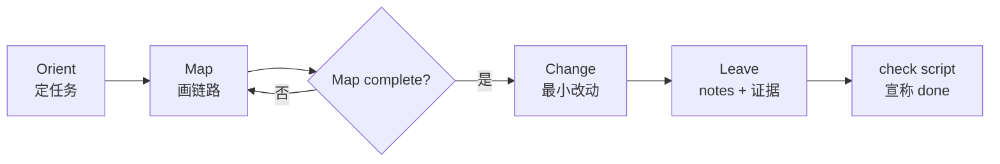
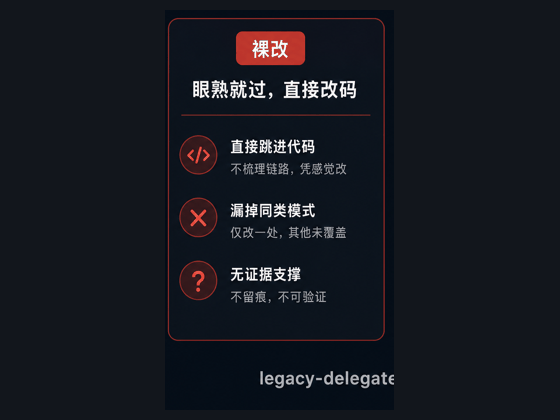

<div align="center">

# legacy-delegate

**Map first. Change second. Leave evidence.**

可审计的遗留仓代工 Skill —— 让不熟项目的 AI **先摸清再改**，修 bug / 加功能 / 轻量重构，并留下可审证据。

[](https://github.com/Seven-second-fish/legacy-delegate/stargazers)
[](LICENSE)
[](https://github.com/Seven-second-fish/legacy-delegate/commits/main)
[](https://cursor.com/docs/context/skills)
[](https://agentskills.io/)

[安装](#安装) · [30 秒看懂](#30-秒看懂) · [真实 Demo](#真实-demo-cakeshop) · [用法](#用法) · [FAQ](#faq)

</div>

---

## 痛点

AI 改遗留代码时，常见翻车：

| 现象 | 代价 |
|------|------|
| 看到相关文件就直接改 | 漏同模式 / 漏调用层 |
| 宣称「修好了」但无证据 | 老人复审要重挖一遍 |
| 改了源码忘 rebuild / 测错层 | 线上仍 500，白忙一场 |

`legacy-delegate` 把「先理解再改」做成**可检查的作业闸门**，不是又一篇「请仔细阅读代码」的提示词。

---

## 30 秒看懂



| 阶段 | 产物 | 硬约束 |
|------|------|--------|
| **Orient** | `task.md` | 类型 / 模式 / 成功标准 |
| **Map** | `map.md` | **未 complete 禁止改业务代码** |
| **Change** | `change.md` + 代码 | 证据 ≥ L1，禁止 L0 宣称 done |
| **Leave** | `notes.md` | 怎么回归、已知未知 |

默认模式：`delegate`（短结论 + 证据，给甩手的老人审）  
可选：`onboard`（多写「为什么」，给新人学）

---

## 特性

- **无 Map 不准改** — 协议闸门 + 可选脚本，降低「眼熟就过」
- **证据分级 L0/L1/L2** — L0 不得宣称完成；L1 可复现；L2 测试/探针
- **bug / feature / 轻量 refactor** 同一条绳，Change 子策略写死
- **产物落盘** `.delegate/<task-slug>/` — 人可审、下个 Agent 可续
- **跨会话续跑** — 同一 slug 接着干；Map 未 complete 仍禁改码
- **轻量 git 线索** — Map 可对触点附 churn/作者，不作 git 故事
- **反 stub 检查脚本** — 空章节 / 占位表格直接 FAIL
- **显式调用** — `disable-model-invocation: true`，小改不会被强行套流程

---

## 安装

### 推荐：`npx skills`

```bash
npx skills add Seven-second-fish/legacy-delegate -g
```

### 手动克隆

```bash
git clone https://github.com/Seven-second-fish/legacy-delegate.git \
  ~/.cursor/skills/legacy-delegate
```

装好后在 Cursor 聊天中**显式调用**（本 skill 关闭自动挂载）：

```text
用 legacy-delegate：这个遗留模块提交订单会 500，先摸清链路再修，证据至少 L1。
```

或输入 `/legacy-delegate`（若客户端支持按 name 触发）。

---

## 真实 Demo（cakeshop）

Demo 仓：[`Seven-second-fish/cakeshop`](https://github.com/Seven-second-fish/cakeshop)（Java / Tomcat / Docker）

### 裸改 vs 启 skill（Demo 资产）



- 浏览器短录屏对照：[docs/demo-walkthrough.html](docs/demo-walkthrough.html)（自动轮播三幕）
- 分享用短贴：[docs/SHARE.md](docs/SHARE.md)（skills.sh / Cursor 社区；第二仓欢迎自带 case）

### Before → After

| | 不启 skill | 启 `legacy-delegate` |
|--|------------|----------------------|
| 做法 | 看到 Servlet 直接加 `if` | Orient → Map（触点+边界）→ Change → Leave |
| bug：`delItem` 空车 | 易漏同文件 `changeIn`；无档可审 | **500 NPE → 302**；同模式一并列入边界 |
| feature：空车提交 | 易只挡一半；无回归说明 | **500 → 200 + 提示**；检查脚本 OK |
| 黄金路径 | 常漏测「有货能否下单」 | 登录→加购→提交 → **订单成功**，守卫未误伤 |

**价值一句话**：同一类空 session NPE —— 强制先画链路与改动边界，再改码并留下 L1 证据，避免「眼熟就过、容器未重建」。

自备对比：同一小问题先裸改一次，再启 skill 走一遍，把 `.delegate/` 产物贴进 PR 描述即可。

---

## 用法

1. 描述任务（bug / 加功能 / 轻量重构）
2. 调用本 skill
3. Agent 在**目标仓**写入：

```text
.delegate/<task-slug>/
├── task.md
├── map.md
├── change.md
└── notes.md
```

4. 宣称完成前跑检查：

```bash
bash ~/.cursor/skills/legacy-delegate/scripts/check_delegate_artifacts.sh \
  .delegate/<task-slug>
```

建议把目标仓的 `.delegate/` 加入 `.gitignore`（产物可含环境细节，默认不入库）。

### Fast path

你已给出精确文件且自认链路清楚时，可要求 fast path：仍须短 map + 证据 ≥ L1，不能跳过 Leave。

### 轻量 refactor

`type: refactor` 时：先**行为锁**（表征测试或手工基线），再改结构；`change.md` 必填 **表征证据**、**回滚点**；默认证据 ≥ L1。禁止跨模块大改或修 bug 时顺手重构。

走通示例：[examples.md](examples.md#轻量-refactor抽纯函数行为保持) · 快照见 `examples/light-refactor-extract-fn/`。

### Resume / 跨会话续跑

若上次对话已留下 `.delegate/<task-slug>/`，直接说：

```text
用 legacy-delegate：继续 .delegate/checkout-coupon-500
```

或只说「继续」（Agent 优先接最新的 `in_progress` / `blocked`，否则问你 slug）。

- 同一目录续跑；在 `task.md` 写 `resume: true`、`last_stage`、`resume_from`
- **未完成闸门仍生效** — Map 未 complete ⇒ 仍禁止改业务代码
- 中途停手：在 `notes.md` 填 **续跑交接**

走通示例：[examples.md](examples.md#resume-interrupted-at-map--new-session) · 快照见 `examples/resume-interrupted-map/`。

### 和 `CLAUDE.md` / `AGENTS.md` 的区别

| | 仓内说明书 | 本 skill |
|--|------------|----------|
| 角色 | 常驻背景与仓规 | 单次任务作业 SOP |
| 何时 | 几乎总在 | 显式调用长链路任务 |

Orient 会**先读**仓规，再跑流程。仓规优先于本 skill 默认习惯。

Map 阶段可对已入触点的文件附可选 **Git 线索**（见 [map-guidance](references/map-guidance.md#何时看-git轻量线索)）；不替代代码链路，也不写入 Map DoD。

---

## 仓库结构

```text
legacy-delegate/
├── SKILL.md          # 主流程（Agent 执行入口）
├── PLAN.md           # 规格、闸门、路线图
├── CONTRIBUTING.md   # 贡献说明
├── examples.md       # 虚构小仓走通（含续跑）
├── examples/         # 产物快照
├── docs/             # Demo GIF / 轮播页 / 分享文案
├── templates/        # task / map / change / notes
├── references/       # bug / feature / refactor / map / resume 指引
└── scripts/
    └── check_delegate_artifacts.sh
```

---

## 何时用 / 何时别用

**适合**

- 接手老项目、陌生模块、长链路 bug
- 跨多层加功能、影响面不清
- 重构怕改炸；「让 AI 改，我只审」

**不适合**

- 纯 typo / 文案，且已指定文件
- 只要概念解释、不动仓
- 已有完整补丁只需代粘贴
- 必须 debugger / 线上观测才能定位，且当前环境取不到证 → 应 `blocked`，勿瞎改

---

## FAQ

<details>
<summary><b>闸门真能强制吗？</b></summary>

不能内核级强制。靠协议约束 + `check_delegate_artifacts.sh`；Agent 宣称 done 前应跑脚本。人审仍看 `map.md` / `change.md` 实质内容。
</details>

<details>
<summary><b>会不会太重、老人嫌烦？</b></summary>

默认 `delegate` 输出短结论；明确文件时可走 Fast path。纯小改本来就不该调用本 skill。
</details>

<details>
<summary><b>和普通 code review skill 有何不同？</b></summary>

本 skill 目标是**代工交付**（改完 + 证据），不是停在报告或 PR 评论。读懂是为了改，且改之前必须有 Map。
</details>

<details>
<summary><b>支持 Claude / Codex 吗？</b></summary>

遵循 Agent Skills 形态（`SKILL.md` + templates/scripts）。可用 `npx skills add` 装到多 Agent；Cursor 为主要验证环境。
</details>

---

## Star History

[](https://star-history.com/#Seven-second-fish/legacy-delegate&Date)

---

## 文档与许可

- 主技能：[SKILL.md](SKILL.md)
- 规格与计划：[PLAN.md](PLAN.md)
- 贡献：[CONTRIBUTING.md](CONTRIBUTING.md)
- 虚构示例：[examples.md](examples.md)
- Demo 资产：[docs/](docs/)
- Demo 仓：[cakeshop](https://github.com/Seven-second-fish/cakeshop)

License: [MIT](LICENSE)

如果这个 skill 帮你少翻一次车，欢迎 **Star** ⭐ —— 也欢迎 Issue / PR 分享你的长链路案例。
