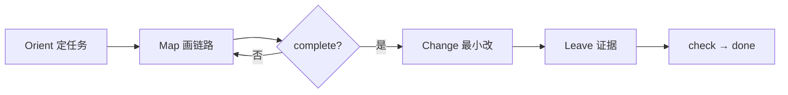

<div align="center">

# legacy-delegate

**先摸清，再动手。改完留下证据。**

> 遗留仓里，AI 最爱「眼熟就过」。  
> 这个 Skill 把代工变成一门课：**没画完链路不准改，没证据不准喊 done。**

可审计的 legacy 代工 —— bugfix / 加功能 / 轻量重构，同一条绳：Orient → Map → Change → Leave。

[](https://github.com/Seven-second-fish/legacy-delegate/stargazers)
[](LICENSE)
[](https://github.com/Seven-second-fish/legacy-delegate/commits/main)
[](https://cursor.com/docs/context/skills)
[](https://agentskills.io/)

**30 秒上手** → [安装](#安装) · **先看结果** → [真实 Demo](#真实-demo) · [为什么要用](#为什么要用) · [用法](#用法) · [用法示例](#用法示例) · [FAQ](#faq)

</div>

---

## 为什么要用

裸改省的是几轮对话；翻车贵的是——**修错层、漏同模式、「应该好了」、下个窗口全忘光**。

`legacy-delegate` 不教模型「更会聊天」，它只做一件专业的事：把长链路代工变成**可检查、可交接的作业**。

| 你受够的 | 开了之后 |
|----------|----------|
| 看到相关文件就下手，同模式漏一半 | **Map 未 complete → 禁止改业务代码** |
| 「修好了」——复审还得自己重挖 | 证据至少 **L1**：同一路径，改前红、改后绿 |
| 聊断了，上下文蒸发 | `.delegate/<slug>/` 落盘，**跨会话续跑** |
| 老人只想 30 秒拍板 | `delegate`：短结论 + 证据 + 风险，甩手可审 |

**不是又一篇「请仔细阅读代码」的提示词**——是闸门 + 模板 + 检查脚本。小改别套；越不熟、越跨层、越要对人负责，越该显式调用。

### Token？换个算法

会贵一点：中等题大约多 **一两万到四万** token。贵的是纪律，不是多建一个文件夹。

少开一轮「修完又炸」的救火，通常就回本。路径门清？走 **[Fast path](#fast-path)**，Map 砍短，证据留下。

> **小改别开。长链路、要留痕、怕返工——开。** Token 买闸门，不买仪式感。

---

## 真实 Demo

同一类空 session NPE，在 [`cakeshop`](https://github.com/Seven-second-fish/cakeshop)（Java / Tomcat / Docker）上对照：

| | 裸改 | 启 `legacy-delegate` |
|--|------|----------------------|
| 做法 | Servlet 里直接加 `if` | 先画触点与**改动边界**，再最小补丁 |
| `delItem` 空车 | 易漏同文件 `changeIn` | **500 NPE → 302**，同模式进边界 |
| 空车提交 | 易只挡一半 | **500 → 200 + 提示**，检查脚本 OK |
| 有货下单 | 常忘回归 | 黄金路径仍通，守卫未误伤 |

浏览器打开权威三幕轮播：[docs/demo-walkthrough.html](docs/demo-walkthrough.html)


[静图](docs/demo-bare-vs-skill.png) · [分享短贴](docs/SHARE.md)

自己仓也能 A/B：同一题先裸改、再启 skill，把 `.delegate/` 贴进 PR——复审立刻有东西可看。

---

## 30 秒看懂



| 阶段 | 硬约束 |
|------|--------|
| **Map** | 未 complete → **不准改业务代码**（合法 fast path 除外） |
| **Change** | 证据 **≥ L1**；L0 不得宣称完成 |
| **Leave** | 怎么回归、已知未知写清楚 |

产物在目标仓：`.delegate/<task-slug>/{task,map,change,notes}.md`  
模式默认 `delegate`（给甩手的人审）；可选 `onboard`（多写为什么，给新人学）。

**能力一览**：bug / feature / 轻量 refactor · 跨会话续跑 · 可选 git 线索 · 反 stub 检查脚本 · **显式调用**（小改不会被强行套流程）

---

## 安装

```bash
npx skills add Seven-second-fish/legacy-delegate -g
```

或手动：

```bash
git clone https://github.com/Seven-second-fish/legacy-delegate.git \
  ~/.cursor/skills/legacy-delegate
```

装好后**显式调用**（`disable-model-invocation: true`，不会自动挂载）：

```text
用 legacy-delegate：这个遗留模块提交订单会 500，先摸清链路再修，证据至少 L1。
```

```text
用 legacy-delegate：继续 .delegate/checkout-coupon-500
```

也支持 `/legacy-delegate`（若客户端按 name 触发）。

---

## 用法

1. 说清任务（bug / 功能 / 轻量重构）  
2. 调用本 skill  
3. Agent 写入 `.delegate/<task-slug>/` 四件套  
4. 宣称完成前跑检查：

```bash
bash ~/.cursor/skills/legacy-delegate/scripts/check_delegate_artifacts.sh \
  .delegate/<task-slug>
```

建议目标仓 `.gitignore` 加入 `.delegate/`。

### 用法示例

**长链路 bug（全 Map）** — 陌生、跨层、要留痕时用：

```text
用 legacy-delegate：POST /checkout 带优惠券会 500，先摸清链路再修，证据至少 L1。
```

Agent 会 Orient → 完整 Map → 定点补丁 → Leave；Map 未 complete 前不改业务代码。

**Fast path** — 文件已知、意图清楚：

```text
用 legacy-delegate，走 fast path：
只改 pricing/coupon.js 里空 expiresAt 的 null 处理，
意图是空值视为永不过期，不要扩范围。证据至少 L1。
```

三件套：**skill 名** + **精确路径** + **一句话意图**。仍写短 map（触点+边界）与 ≥ L1 证据；不做完整八项 DoD 考古。意图糊（「修一下 checkout」）或一挖跨很多层 → 拒 fast path，走全 Map。

**续跑** — 同一任务跨会话接着干：

```text
用 legacy-delegate：继续 .delegate/checkout-coupon-500
```

同一 slug 接着写；Map 未 complete 仍禁改码。中途停 → `notes.md` 填**续跑交接**。  
示例：[examples.md](examples.md#resume-interrupted-at-map--new-session)

**近邻新任务（暖启动）** — 仓里已有做过的 `.delegate/`，新题在附近但未点名旧产物：

```text
用 legacy-delegate：结账附近优惠券边界又有问题，先摸清再修。
```

Agent 可扫近邻产物，只摘触点/边界作线索（新开 slug）；相关时会问是否参考。不会把旧 map 直接标成新任务 complete。

**别开 skill** — 已点名文件的 typo / 单行文案、只要解释不动仓、完整补丁只需代粘贴：直接改或直接答，不必套 Orient→Leave。

### 轻量 refactor

先**行为锁**，再改结构；`change.md` 必填表征证据与回滚点。禁止跨模块大改、修 bug 时顺手重构。  
示例：`examples/light-refactor-extract-fn/`

### 和仓规的关系

`AGENTS.md` / `CLAUDE.md` = 常驻说明书；本 skill = **单次任务作业 SOP**。Orient 先读仓规，仓规优先。

---

## 何时开 / 何时别开

| 开 | 别开 |
|----|------|
| 陌生模块、长链路 bug | 已点名文件的 typo / 文案 |
| 跨层加功能、影响面不清 | 只要解释、不动仓 |
| 重构怕炸；「AI 改，我只审」 | 完整补丁只需代粘贴 |
| 高难度、要对人负责 | 缺复现/环境 → 应 `blocked`，勿瞎改 |

---

## FAQ

<details>
<summary><b>闸门能强制吗？</b></summary>

不能内核强制。靠协议 + `check_delegate_artifacts.sh`；人审看 `map.md` / `change.md` 实质。
</details>

<details>
<summary><b>老人会嫌重吗？</b></summary>

默认短结论；文件清楚走 Fast path；纯小改别调用。见 [为什么要用](#为什么要用)。
</details>

<details>
<summary><b>为什么耗 token / 怎么少耗？值吗？</b></summary>

不承诺比裸改更便宜；优化的是返工与误伤，不是单次最少 token。值在少翻车（少一轮假修复往往回本）。少耗靠分流：纯小改别调用、点名文件+意图走 Fast path、陌生/跨层才付全 Map；续跑/暖启动读 `.delegate/` 摊薄后续会话。详见 [SKILL.md](SKILL.md) Token 经济与 [references/token-economy.md](references/token-economy.md)。
</details>

<details>
<summary><b>和 code review skill 啥区别？</b></summary>

目标是**代完 + 留证**，不是停在评论。读懂是为了改，且改前必须有 Map。
</details>

<details>
<summary><b>Claude / Codex？</b></summary>

Agent Skills 形态；`npx skills add` 可装多端。Cursor 为主要验证环境。
</details>

<details>
<summary><b>刚宣称修好的控件「还是不行 / 能开不能选」怎么办？</b></summary>

走**验收追诉**：重开**同一** `.delegate/<slug>/`，在 `change.md` 追加追诉证据；不要当新任务新开 slug。详见 [references/resume-workflow.md](references/resume-workflow.md#验收追诉done-后同控件跟进)。
</details>

---

## 仓库结构

```text
legacy-delegate/
├── SKILL.md           # Agent 执行入口
├── PLAN.md            # 规格与路线图
├── templates/         # task / map / change / notes
├── references/        # bug · feature · refactor · map · resume · warm-start · token-economy
├── scripts/           # check（含 --draft）· smoke · demo 资产
├── examples.md        # 虚构走通
├── examples/          # 产物快照
├── docs/              # Demo 轮播 / GIF / 分享
├── test-prompts.json  # 轻量 eval
└── CONTRIBUTING.md
```

---

## Star History

[](https://star-history.com/#Seven-second-fish/legacy-delegate&Date)

---

## 文档与许可

[SKILL.md](SKILL.md) · [PLAN.md](PLAN.md) · [examples.md](examples.md) · [docs/](docs/) · [cakeshop Demo](https://github.com/Seven-second-fish/cakeshop) · [CONTRIBUTING](CONTRIBUTING.md)

License: [MIT](LICENSE)

少翻一次车，就值一个 **Star** ⭐ —— 也欢迎用你的长链路 case 开 Issue / PR。
