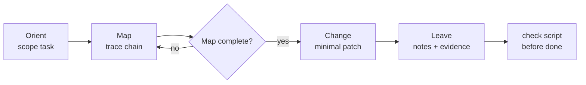

<div align="center">

# legacy-delegate

**Map first. Change second. Leave evidence.**

An auditable **legacy-codebase delegation** skill: force unfamiliar AI agents to **map call chains before editing**, then ship bugfixes / features / light refactors **with evidence** humans can review in 30 seconds.

[English](README.md) · [简体中文](README.zh-CN.md)

[](https://github.com/Seven-second-fish/legacy-delegate/stargazers)
[](LICENSE)
[](https://github.com/Seven-second-fish/legacy-delegate/commits/main)
[](https://cursor.com/docs/context/skills)
[](https://agentskills.io/)

[Install](#install) · [30-second overview](#30-second-overview) · [Live demo](#live-demo-cakeshop) · [Usage](#usage) · [FAQ](#faq)

</div>

---

## The problem

When AI edits unfamiliar legacy code, it often fails like this:

| What happens | Cost |
|--------------|------|
| Jumps into the “obvious” file and patches | Misses same-pattern siblings / other layers |
| Claims “fixed” with no evidence | Senior review means re-digging the chain |
| Edits sources but forgets rebuild / wrong layer | Prod still 500 — wasted cycle |

`legacy-delegate` turns **understand-before-edit** into a **checkable work protocol** — not another “please read carefully” prompt.

---

## 30-second overview



| Stage | Artifact | Hard rule |
|-------|----------|-----------|
| **Orient** | `task.md` | type / mode / success criteria |
| **Map** | `map.md` | **no business-code edits until `complete`** |
| **Change** | `change.md` + code | evidence ≥ L1; never claim done at L0 |
| **Leave** | `notes.md` | how to regress + known unknowns |

Default mode: `delegate` (short verdict + evidence for seniors who only review)  
Optional: `onboard` (more “why” for newcomers)

---

## Features

- **No Map, no Change** — protocol gate + optional script against “looks familiar, ship it”
- **Evidence grades L0 / L1 / L2** — L0 cannot claim done; L1 = reproducible; L2 = tests / probes
- **bug / feature / light refactor** on one rope, with typed Change strategies
- **Artifacts on disk** under `.delegate/<task-slug>/` — human-auditable, next agent can resume
- **Anti-stub checker** — empty sections / placeholder tables fail
- **Explicit invocation only** — `disable-model-invocation: true` so tiny edits are not forced into the full flow

---

## Install

### Recommended: `npx skills`

```bash
npx skills add Seven-second-fish/legacy-delegate -g
```

### Manual clone

```bash
git clone https://github.com/Seven-second-fish/legacy-delegate.git \
  ~/.cursor/skills/legacy-delegate
```

Then **explicitly invoke** in Cursor chat (auto-mount is off):

```text
Use legacy-delegate: this legacy checkout endpoint returns 500 with a coupon.
Map the chain first, then fix. Evidence at least L1.
```

Or type `/legacy-delegate` if your client supports name-based triggers.

---

## Live demo (cakeshop)

Demo repo: [`Seven-second-fish/cakeshop`](https://github.com/Seven-second-fish/cakeshop) (Java / Tomcat / Docker)

### Before → After

| | Without the skill | With `legacy-delegate` |
|--|-------------------|-------------------------|
| Approach | Spot a Servlet, add `if` | Orient → Map (touches + boundary) → Change → Leave |
| Bug: empty-cart `delItem` | Easy to miss sibling `changeIn`; no audit trail | **500 NPE → 302**; same pattern in Map boundary |
| Feature: submit empty cart | Half-guarded; no regress notes | **500 → 200 + message**; checker OK |
| Happy path | Often skipped | Login → add → submit → **order success**; guards did not false-positive |

**One-liner:** for the same empty-session NPE class — force a chain map and change boundary, then patch with L1 evidence so you do not “ship on vibe” or forget to rebuild the container.

DIY A/B: fix the same issue once bare, once with the skill, and paste `.delegate/` artifacts into the PR description.

---

## Usage

1. Describe the task (bug / feature / light refactor)
2. Invoke this skill
3. The agent writes into the **target repo**:

```text
.delegate/<task-slug>/
├── task.md
├── map.md
├── change.md
└── notes.md
```

4. Before claiming done, run:

```bash
bash ~/.cursor/skills/legacy-delegate/scripts/check_delegate_artifacts.sh \
  .delegate/<task-slug>
```

Add `.delegate/` to the target repo’s `.gitignore` (artifacts may include environment details).

### Fast path

If you already named exact files and own the chain, request fast path: still need a short map + evidence ≥ L1; do not skip Leave.

### vs `CLAUDE.md` / `AGENTS.md`

| | Repo handbook | This skill |
|--|---------------|------------|
| Role | Standing context & conventions | Per-task work SOP |
| When | Almost always loaded | Explicit long-chain jobs |

Orient **reads repo rules first**, then runs the flow. Repo rules win over skill defaults.

---

## Repository layout

```text
legacy-delegate/
├── SKILL.md          # main protocol (agent entry)
├── PLAN.md           # spec, gates, roadmap
├── examples.md       # fictional walkthrough
├── templates/        # task / map / change / notes
├── references/       # bug / feature / refactor / map guides
└── scripts/
    └── check_delegate_artifacts.sh
```

---

## When to use / when not to

**Use when**

- Inheriting legacy modules or long investigation chains
- Cross-layer features with unclear blast radius
- Refactors you are afraid will explode; “AI edits, I only review”

**Skip when**

- Pure typo / copy, file already named
- Concept explanation only — no repo changes
- Full patch already exists and only needs applying
- Needs debugger / prod signals you cannot obtain → set `blocked`, do not guess

---

## FAQ

<details>
<summary><b>Are the gates kernel-enforced?</b></summary>

No. They are protocol + `check_delegate_artifacts.sh`. Agents should run the script before claiming done. Humans still judge substance in `map.md` / `change.md`.
</details>

<details>
<summary><b>Is this too heavy for seniors?</b></summary>

Default `delegate` mode is short. Fast path exists when files are known. Tiny edits should not invoke this skill at all.
</details>

<details>
<summary><b>How is this different from a code-review skill?</b></summary>

This skill aims at **delegated delivery** (ship the change + evidence), not a report or PR comments. Understanding exists so you can change — and you must Map before Change.
</details>

<details>
<summary><b>Does it work with Claude / Codex?</b></summary>

It follows the Agent Skills shape (`SKILL.md` + templates/scripts). Install via `npx skills add` for multiple agents; Cursor is the primary validated environment.
</details>

---

## Star History

[](https://star-history.com/#Seven-second-fish/legacy-delegate&Date)

---

## Docs & license

- Skill: [SKILL.md](SKILL.md)
- Spec / plan: [PLAN.md](PLAN.md)
- Fictional example: [examples.md](examples.md)
- Demo repo: [cakeshop](https://github.com/Seven-second-fish/cakeshop)
- Chinese README: [README.zh-CN.md](README.zh-CN.md)

License: [MIT](LICENSE)

If this skill saves you one bad legacy patch cycle, a **Star** helps others find it. Issues / PRs with real long-chain cases welcome.
